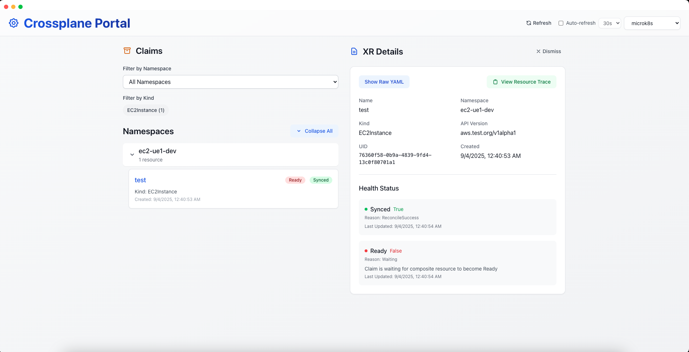
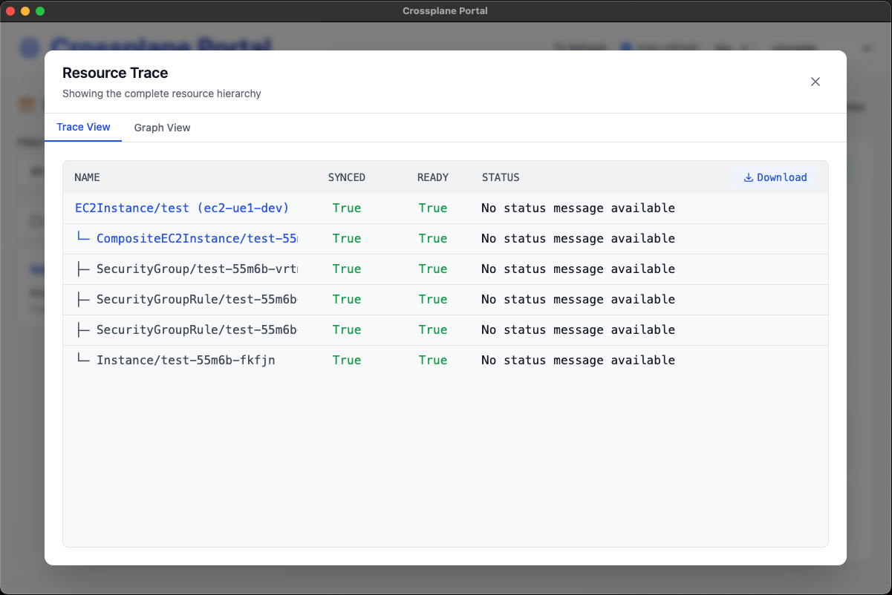
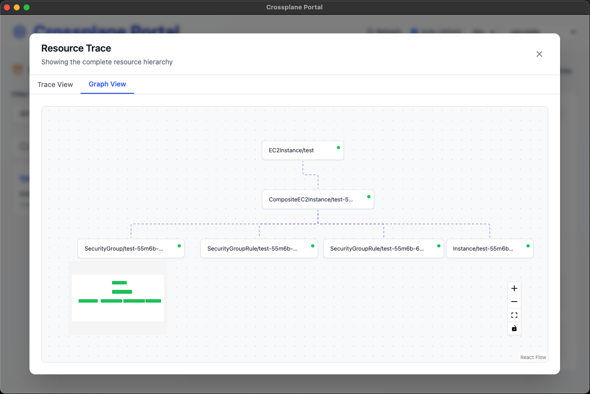
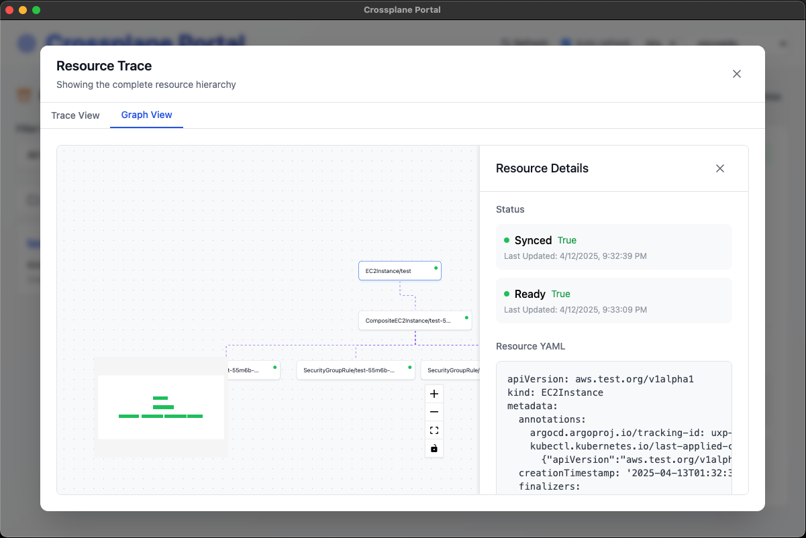

# Crossplane Portal

A desktop application for managing and visualizing Crossplane resources with a modern, user-friendly interface.

## Features

### Resource Overview

Monitor your Crossplane claims with an intuitive interface:
- Filter resources by namespace
- Auto-refresh with configurable intervals (30s, 1m, etc.)
- Quick context switching with the Kubernetes context selector
- Visual health status indicators for each resource
- Clean, modern UI with clear resource organization

### Resource Trace

Understand your resource hierarchy with a comprehensive trace view:
- Complete resource dependency tree
- Status indicators for both Synced and Ready states
- Detailed status messages for each resource
- Downloadable trace information
- Toggle between tree and graph views

### Resource Graph

Interactive visualization of resource relationships:
- Hierarchical graph layout showing resource dependencies
- Visual status indicators for each resource
- Interactive controls for zooming and panning
- Full-screen mode for better visualization
- Resource details panel for selected nodes

### Resource Details

Detailed view of your Crossplane resources:
- Resource metadata including name, namespace, and UID
- Real-time health status monitoring
- Synced and Ready state indicators with timestamps
- Raw YAML view for detailed configuration inspection
- Resource trace visualization

## Installation

Download the latest release from the [releases page](https://github.com/mitchelldavis44/crossplane-portal/releases).

For detailed build and installation instructions, see [BUILD.md](BUILD.md).

## Requirements

- A running Kubernetes cluster with Crossplane installed
- Valid kubeconfig with access to Crossplane resources

## Contributing

Contributions are welcome! Please feel free to submit a Pull Request.
